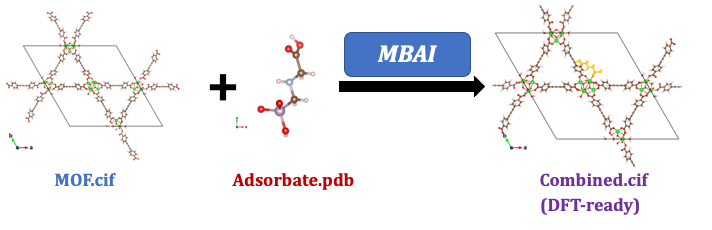

# MOF Big Adsorbate Initializer (MBAI)
A quick way to add (big) adsorbate molecules on specified binding sites on MOFs with a decent geometry (which can serve as initial structures for periodic DFT optimizations). This has been a pain for me (maybe for you too) in several projects as CIF files are hard to edit with GUI. Name is blatantly plagiarized from Andrew's [MAI](https://github.com/arosen93/mof-adsorbate-initializer).

## Quick Start
Different from Andrew's approach in MAI (which is for adsorbates with <=3 atoms, AFAIK), the basic idea of MBAI is to use Monte Carlo (in RASPA) to guide the adsorbates to the binding sites you want, because systematic construction approach as in MAI might get untractable when the adsorbate is large. To make this work, super strong Lennard-Jones parameters are assigned to the pair(s) of atoms you want to bind.  Basically what you need to do is to **draw your adsorbate** in Gaussview and save as a PDB, **change the label of the binding site(s) on the MOF** to 'Z0' (if bidentate, change the other site to 'Z1') in the CIF file, **let the program know which atom(s) on the adsorbate will be binding** to Z0 and Z1, then you're good to go! For a quick start, please take a look at the examples I provided, which contains step-to-step instructions in the 0README files.

## Troubleshooting
If the binding geometry doesn't look good, just re-run the simulation (maybe with more cycles, especially for bi-dentate binding). You can also try changing the temperature but I found that 100K (the default) is kind of optimal because at 298K it's too easy for non-binding configurations to be accepted. I tried 1K too but it'll just freeze at the initial configuration. You can also tune the epsilon of the special Lennard-Jones potential, but the default value (10000K) seems to be pretty good from trial and error.

## Prerequisites
[Gaussview](https://gaussian.com/gaussview6/) or [Avogadro](https://avogadro.cc/), [RASPA](https://www.iraspa.org/RASPA/index.html), [iRASPA](https://www.iraspa.org/iRASPA/index.html), [ase](https://wiki.fysik.dtu.dk/ase/)

## To-Do
Flexible adsorbates (read OPLS/TraPPE from RASPA and assign bonds/angles/torsions), multiple adsorbates (need to let the adsorbates repel each other)

## Documentation
TBD
